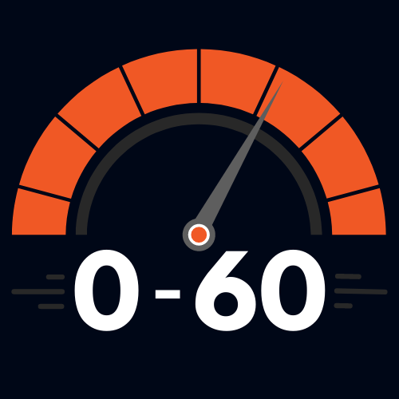

name: agenda
layout: true
class: tetrate-light, regular-slide
.company-logo[ ]

---
class: regular-slide, middle

.two-columns[
.left-column[
## Welcome to Istio 0 to 60!
]

.right-column[.abs-layout.top-15.right-10.center[]]
]

---
class: regular-slide

# Meet the workshop instructors
## Istio 0 to 60

- Eitan Suez
- Peter Jausovec

---
class: regular-slide

# About this workshop
## Istio 0 to 60

- Get up and running quickly with Istio
- Prerequisites
  - Basic understanding of Kubernetes, Docker, and Linux command line.

---
class: regular-slide

# Logistics
## Istio 0 to 60

- Duration: 3 hours
  - 15 minute break half-way through the training
- Communication support through slack channel
  - https://tetrateeducation.slack.com/
  - channel #istio-0to60-workshop

---
class: regular-slide

# Learn by doing
## Approach

- _Lab-driven_ training
- Minimize the use of slides
- We request your active participation
  - Please ask questions

---
class: border-layout
background-image: url(./images/bg.jpeg)
background-size: cover

.west.height-100.width-20.p-l.text-white[
  # Schedule
]

.east.height-100.width-55.p-l.bg-white[
  .agenda-item[
  .pb-0[### Lab environments]
  .pt-0[Configure access to your lab environment]]

  .agenda-item[
  .pb-0[### What problems does Istio address?]
  .pt-0[A high-level introduction and overview of Istio]]
  
  .agenda-item[
  .pb-0[### Install Istio]
  .pt-0[Get your cluster installed and configured with Istio]]

  .agenda-item[
  .pb-0[### Sidecar injection and the app under test]
  .pt-0[Deploy a simple application to the mesh, and expose it with Ingress]]

  .agenda-item[
  .pb-0[### Observability, Security, Traffic shifting]
  .pt-0[Three labs that cover the essential cross-cutting concerns that Istio addresses]]

  .agenda-item[
  .pb-0[### Summary]
  .pt-0[]]
]

---
class: center, middle

# Workshop labs

https://tetratelabs.github.io/istio-0to60/

---
class: regular-slide

# Environments
## In a nutshell

- Environments in Google Cloud Platform (GCP)
- A Kubernetes cluster is provisioned for each attendee
- All work will be done in the Google Cloud Shell
- We start with a lab to get your environment setup
