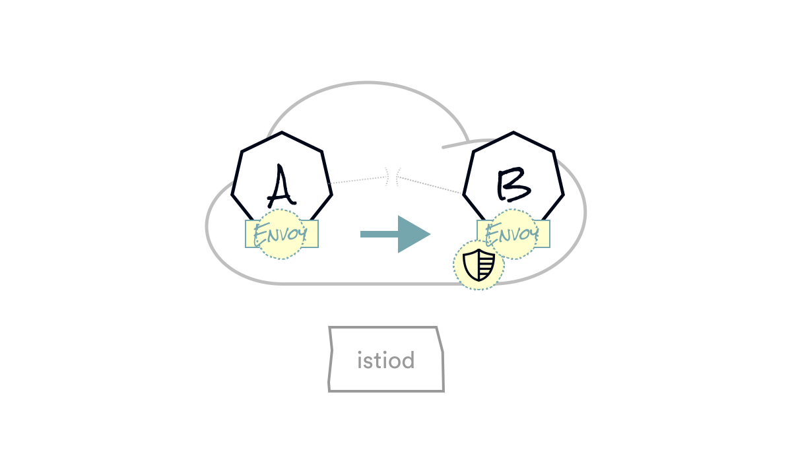

class: center, middle

# Istio Architecture

---

layout: true
class: tetrate-light, one-pic-text-slide
.company-logo[ ]

---

Story as old as time:

Service A meets service B...

???

To explain how Istio works, we will introduce two services - service A and service B that are talking to each other.

From our perspective it doesn’t really matter what the communication is or what protocols are used, we can just say it’s HTTP, but it really doesn’t matter.

---

Deploy a proxy (Envoy) beside your application ("sidecar deployment")

???

The first and the most critical piece of the mesh and Istio is deploying Envoy beside every application. We call this a sidecar deployment.

This sidecar intercepts all of the network traffic in and out of the application and it gives us the point to apply all of the policy and all of the resiliency features that we talked about. The network is the interface point with the outside world, and if we can capture that we can do a lot of fancy stuff. We’ll look at this in more details later on.

The collection of these Envoys are Istio’s data plane.

---

First logical component is Galley, which is responsible for validating incoming config.

???

We have a set of Envoy sitting there, but now we need a way to configure them and to give them behavior

This is where the Istio Control Plane comes in. The Istio’s control plane is in the istiod binary.

This used to be a microservice architecture where each of the components than now lives in a single binary was a separate service, but was merged back into a monolith to improve operational experience.

The first piece of the control plane in the binary is called Galley.

If we think about our application as having a 3 tier architecture - we have the data plane (envoys at the bottom), a control plane which the things that control and affect the behavior of the data plane and we have a management plane which is what users interact with to affect change in the system. Galley is istio’s management plane. It’s like an API server that’s responsible for taking configuration from the configuration store (in kubernetes, Galley talks to kubernetes api server for configuration), and it takes that, validates it and pushes it to other istio components.

---

Pilot distributes the validated networking configuration to each Envoy

???

The key piece of the control plane from the perspective of Envoys is the Pilot.

Pilot is the piece responsible for taking configuration from Galley (these are the things we write in YAML - things like Gateways, VirtualServices, networking config and so on). Pilot combines that with view of the world that it gets from the set of service registry - in kubernetes we go and talk to kubernetes API server to get the services that exist in the system ,what are their endpoints.

Pilot takes these things and builds a model of what the mesh should be and it realizes that into configuration for Envoys and it pushes it to the Envoys that control the runtime behavior.

---

...and Pilot also distributes policy

???

In addition to distributing the network configuration, Pilot also distributes policies.

---

Citadel assigns SPIFFE identities to enable secure communication

???

Final piece is called citadel and it’s responsible for identity issuance and certificate rotation. We will talk about this later, but in short, Istio mints x.509 certificates - these are the certs you would typical use for things like terminating a website for HTTPS. But the certs Istio mints are ephemeral - they only live for a couple of hours - they encode the identity of the service and we do that authentication of the service, issue the identity and then that identity is used at runtime.

We call that a SPIFFE identity to each workload in the mesh.

SPIFFE stands for secure production identity framework for everyone and it provides a secure identity in a form of a specially crafted x.509 certificate.

Now that they have identities we can start to enforce policy (authorization or authz)

---

Control plane - Istiod
???

So to summarize, Istiod does the following:

Configures the network
Provides identities
Distributes policies to enforce

Let’s go back to that call and service A and service B ...

---

Now, let's track that call

???

So A is calling B

---

Envoy intercepts it

???

Since Envoy is running alongside your application it transparently intercepts the call. The way it does that is by modifying the iptables rules and intercepting any incoming and outgoing traffic. Since we are inside Kubernetes containers within the Pod share the network space - so any iptables rules modification that’s made by the init container inside the Pod will be preserved and apply to other containers within the pod.

Transparently here means that service A is not aware that the request is being intercepted.

So when service a makes a request to service B, Envoy needs to determine the actual destination….

---

Uses the configuration to pick a new destination

???

We eventually pick one destination and then Envoy forwards the request.

We don’t necessarily know that there’s an Envoy on the other side, the client is oblivious.

---

Verifies the destination's identity

???

But we forward the request, B happens to have another sidecar and that sidecar intercepts the request and checks the destination's identity.

---

The receiving Envoy checks the sender's identity

???

The server Envoy also referred to as the upstream Envoy checks the sender's identity.

---

The receiving Envoy checks policy

???

Then, Envoy checks the policy to see if it should let the request forward or not. This is where we can apply our service to service communication policy and decide if the call should go through or not.

---

Envoy hands the request to B

???

So let’s assume the request goes through.

Then envoy will forward that to B and B does the work it needs to do to assemble the answer, call other services and eventually B prepares the response and it sends it back over the network.

---

B answers

???

Again, Envoy intercepts that response, forwards it back to the client that requested it and then client envoy forwards it back to the destination application.

---
layout: false
class: two-columns

.left-column-66[]

.right-column-33[
  **Istiod** - Control plane Manager, handling all communications with the Sidecars (Discovery, Configuration Validation, Configuration (xDS), CA Authority, Authz, Authn, Sidecar-Injector,…)

  **Envoy** - Network proxy to intercept communication and apply policies.]

???

If we zoom out a bit and recap. At a high level we have a data plane and a control plane.

Data plane is a collection of Envoy proxies that run next to your applications -Envoys intercept communication and applies policy.

The control plane is a single binary called istiod with the following components:
Galley for configuration validation and distribution
Pilot to configure and push service configuration
Citadel for identity and credential management.