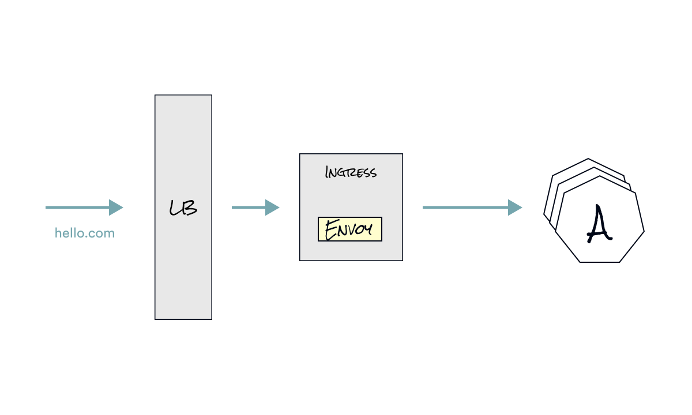
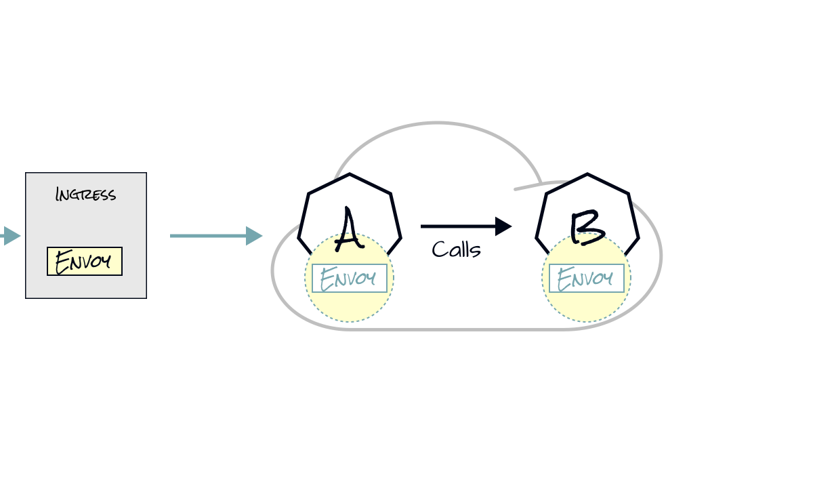

layout: true
class: tetrate-light, one-pic-text-slide
.company-logo[ ]

---
class: center, middle

# Ingress

---

???

So let’s dig a bit deeper and see how the request moves under the covers.

In the previous we had service A calling service B, but the same thing happens if there’s an ingress involved -- a request comes in through the cloud load balancer - we configured hello.com to point to the load balancers IP address, once it hits that address the request goes through the ingress controller - in our case that’s Envoy proxy;  then, based on the routing rules the ingress controller routes the request to Service A. and from there service A can call Service B for example.

---

???

Let’s get back to this slide where the call comes in to service A. 

We have the Envoy proxy sidecar next to every application

---
layout: false
class: tetrate-light, regular-slide

# What can we say about Ingress?

1. Ingress Pod runs in `istio-system` namespace
2. Configured logically in Kubernetes with the `Gateway` custom resource
3. Routing configured separately with `VirtualService` custom resource
