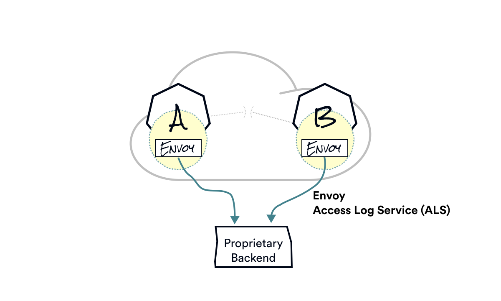

class: center, middle

# Observability

---

layout: true
class: tetrate-light, one-pic-text-slide
.company-logo[ ]

---

Metrics to Prometheus

???
As part of the observability lab that’s coming up next, you will install Prometheus and Grafana.

Prometheus scrapes the Envoys for metrics about the traffic flowing through our mesh - prometheus is configured in such a way that it looks for certain annotations on the pods - we mentioned those annotations earlier when we talked about what gets injected into the pod spec.

Once you’re collecting the metrics using Prometheus, we can use something like Grafana to visualize them  - there’s a couple of built-in dashboards already that you can explore during the lab

---

Traces to Zipkin

???
In addition to Prometheus and Grafana, you will also install Zipkin. 
(Additionally, IStio also supports Jaeger and Lightstep (observability platform)).

Envoys asynchronously report traces to Zipkin or Jaeger

---

Whatever you want via the Access Log Service

???

Additionally if using the Envoy Access Log Service you could configure any other proprietary backend.

