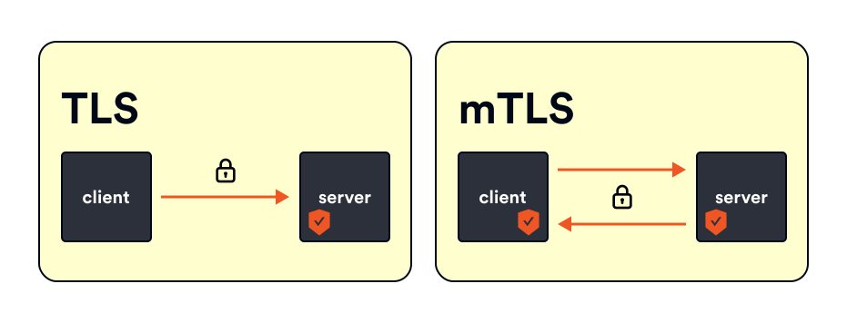
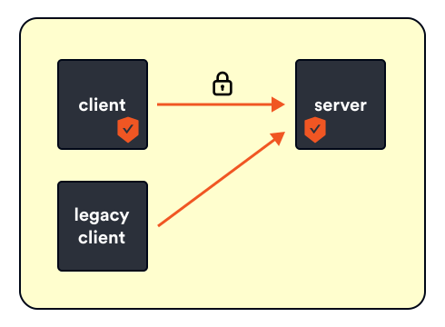
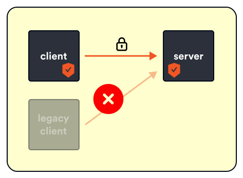

layout: true
class: tetrate-light, regular-slide
.company-logo[ ]

---

class: center, middle

# Secure your environment


---

# Identifying workloads
## Authentication (authn)

- Each workload is assigned a unique identity that it uses to communicate with other workloads
  - Kubernetes = Istio uses service accounts

???

Authentication or authn is all about the principal - or if we’re talking about service, it’s about service identity.

When we say we are performing authentication we are validating some sort of a credential and ensuring that credential is valid and trusted.

Once the authentication succeeds, we can talk about an authenticated principal.  If the credential is not valid or can’t be trusted we say that we have an unauthenticated principal OR we didn’t even have a principal to authenticate in the first place.

An example of authentication is when you’re traveling and you have to present your passport or an ID to the customs officer - they are the ones that authenticate your passport or ID and ensure that it’s valid and trusted.

---

# SPIFFE overview
## Secure production identity framework for everyone

- X.509 certificate (from SA) + SPIFFE spec = **IDENTITY**
- SPIFFE is a spec that describes:
  - A **naming scheme** for workload identities
    - `spiffe://cluster.local/ns/default/sa/my-sa`
  - How to **encode those names** into a X.509 certificate
  - How a client **Validates an X.509** certificate to authenticate the SPIFFE identity inside of it


???

In Kubernetes, each workload gets a assigned a unique identity - this identity is then used when the workloads communicate with each other. The identity in Kubernetes takes the form of a kubernetes service account. This service account is the identity Pods use and present at runtime.

Istio uses the X.509 certificate from the service account and it creates a new identity according to the spec called SPIFFE (secure production identity framework for everyone).

What SPIFFE does is describes the following:
- A naming convention that’s universal and based on a URI (it’s a path)
- It describes how to take that identity and encode it into different documents - the one that we care about is the X.509 certificate -
- The guarantee SPIFFE makes is that when you create a X.509 certificate, fill in these specific fields in specific ways and if you do that, then when you do a normal certificate validation (there’s a well known way we do PKI path validation), if you do a one more step while you’re validating that certificate then you can authenticate the identity inside the certificate

So SPIFFE says - if you have X.509 AND you handle it this way AND you authenticate it the standard way AND after you’ve authenticated it the standard way, you check the subject alternate name, then it’s a valid SPIFFE identity - it is an authenticated principal.

At runtime we take these certificates are do mutual TLS - the Envoy proxies are modified so when they do the TLS handshake they will do that extra bit required by SPIFFE validation and those authenticate principals (both source and destination) are made available for policy.


---

# Mutual TLS (mTLS)



???

Now that we have these identity we can use them at runtime to do mutual TLS.

So what is mutual TLS?

Traditionally when we do TLS is one way - you go to the browser, google.com and you’ll see the lock and look at the certificate and all that. But I didn’t give google any proof of my identity, I just made a request. This is where mutual TLS is fundamentally different.
When two services try to communicate with mutual TLS, it’s required that both of them to provide certificates to each other, so both parties know who they are talking to.
Mutual TLS is great and you should have it turned on for all your services, however, there might be scenarios where you have legacy applications that are not supporting mutual TLS yet and there’s also a timing problem….

Let’s suppose we want to enable mutual TLS across our deployment.  You have a chicken and egg problem if you want to do mutual TLS - a connection will either be mutual TLS or not.

The client connecting to a server via mutual TLS where the server is not accepting mutual TLS doesn’t work.  And a server attempting to serve mutual TLS where a client wants plain text communication doesn’t work either.

That means, if I want to just enable mutual TLS I have to redeploy client and server in a coordinated manner at the same time - this is impossible, you can’t do that reliably and even if you magically do it somehow, it won’t be repeatable.

Fortunately, Istio has a graceful mode where we can opt into mutual TLS - it’s called permissive mode.


---

.center[**Permissive**]





???

Permissive mode is enabled by default when you install Istio. With permissive mode enabled, if a client tries to connect to me via mutual TLS, I'll serve mutual TLS. If the client doesn't use mutual TLS, I can respond in plain text as well. I am permitting the client to do mTLS or not. Using this mode you can gradually rollout mutual TLS across your mesh.

So for your servers you can turn on permissive mode and provision certificates; if a client wants to do mutual TLS, it will be accepted same with simple TLS. Then you can go to your clients and gradually roll out mutual TLS there. You can do that service per service and gradually opt in your services.

Once you moved all services over you can then remove the permissive mode and set it to STRICT

---

.center[**Strict**]



???

Strict mode says that you can only do mutual TLS; so if any client tries to connect they will have to do mutual TLS and present their certificate.

---

# Peer authentication
## Service-to-service communication

- Controls communication between services
  - `PERMISSIVE` (default)
  - `STRICT`
- Mesh, namespace, workload, and port level

???

This brings us to the first resource -- PeerAuthentication.
PeerAuthentication resource controls the communication between the workloads. Using PeerAuthentication we can configure the mutual TLS (mTLS) mode that's used when workloads communicate.
The default mode is set to permissive - so service that do mtls can use mtls and if they only do plaintext everything will still work.

Also, you can control the mutual tls mode at the mesh level - you can configure permissive or strict mode across the whole mesh, or in specific namespaces, or go even more granular and use labels to set the mtls mode for specific workloads only. If that’s not enough you can also control the mtls mode for specific ports -- for example you can set up STRICT mtls for some workloads, but then disable MTLS for communication on specific ports only.

---

# Peer authentication
## Namespace level

```yaml
apiVersion: security.istio.io/v1beta1
kind: PeerAuthentication
metadata:
  name: default
  namespace: foo
spec:
  mtls:
    mode: STRICT
```

???
Here are a couple of examples --  this example sets the strict mtls mode for all workloads in the foo namespace.


---

# Peer authentication
## Workload level

```yaml
apiVersion: security.istio.io/v1beta1
kind: PeerAuthentication
metadata:
  name: default
  namespace: foo
spec:
  selector:
    matchLabels:
      app: prod
  mtls:
    mode: STRICT
```

???

This is similar one, but here we’re setting strict mode only to workloads with the specified label set using the selector and matchLabels field.

---

# Peer authentication
## Port level

```yaml
apiVersion: security.istio.io/v1beta1
kind: PeerAuthentication
metadata:
  name: default
  namespace: foo
spec:
  mtls:
    mode: STRICT
  portLevelMtls:
    5000:
      mode: DISABLE
```

???

finally , port level -- where we set the STRICT mode for all workloads, and disable MTLS for port 5000

---

class: center, middle

# What about users?

???

So we’ve talked about services and how they communicate but we haven’t mentioned anything about users, so how do we authenticate users in Istio?

---

# Request authentication
## User authentication

.two-columns[
.left-column[
- Uses JWT tokens
- Mesh/namespace/workload scope
- Also at ingress level:
  - `forwardOriginalToken`
]
.right-column[
```yaml
apiVersion: security.istio.io/v1beta1
kind: RequestAuthentication
metadata:
  name: httpbin
  namespace: default
spec:
  selector:
    matchLabels:
      app: httpbin
  jwtRules:
* - issuer: "issuer-foo"
*   jwksUri: "someuri""
```
]
]

???

Enter RequestAuthentication resource -- The RequestAuthentication is used for end user authentication and it verifies the credentials attached to the request. The request-level authentication is done with JSON Web Token (JWT) validation.
So just like we used SPIFFE identity to authenticate the services, we can use JWT tokens to authenticate users.

Let’s explain this with this sample resource …
This RequestAuthentication resource applies to all workloads in the default namespace that have the app: httpbin label set.

Any request made to these workloads will need a JWT token. The RequestAuthentication resource configures how the token and its signature is authenticated using the provided key set in the jwksUri field.

If the request to the selected workload does not contain a valid JWT token, that's the token that doesn't conform to those rules, the request will be rejected. On the other hand if we don't provide a token at all, the request will not be authenticated.

Let’s assume we have authenticated the request - once we have that then we can talk about the second part of the original access control question - "performing an action on an object". This is what authorization is about.

Just like the peer authentication, the request authentication can also be scoped at the mesh, namespace of workload level.

Also, you can configure request authentication at the Ingress level as well - you can do that by specifying the istio: ingressgateway label for example. If you do that at the edge but then you want to perform any additional JWT token logic, for example you want to do authorization policies inside your mesh, you can set the forwardOriginalToken field to true -- that will pass the original token to upstream services.

Istio takes this configuration and translates it into the Envoy config - and also verify various pieces of the JWT token itself.

---
# JWT authentication filter

.two-columns[
.left-column-33[
- Authn enforced by the filter
- Doesn't deny requests without JWT tokens (*allowMissing*)
  - Used together with AuthorizationPolicy
]
.right-column-66[
```yaml
name: envoy.filters.http.jwt_authn
typedConfig:
  providers:
*   origins-0:
      issuer: testing@secure.istio.io
      localJwks:
        inlineString: '...'
      payloadInMetadata: testing@secure.istio.io
  rules:
  - match:
      prefix: "/"
    requires:
      requiresAny:
*       requirements:
*       - providerName: origins-0
*      - allowMissing: {}
```
]
]

---

# JWT authentication filter
## When are the requests approved/denied

.two-columns[
.left-column[
**DENIED**

- Mismatching issuers
- Token expired
- Invalid audience (if provided)
- Invalid signature

]
.right-column[
**APPROVED**

- Valid JWT
- No JWT
  - Use AuthorizationPolicy
]
]

???
The filter checks for multiple things to verify the token -- if the issuers on JWT doesn’t match or if the token is expired, the requests will be defined. Similarly if you provided an audience in the resource and they don’t match, then request will be denied as well. Finally when checking the signature through the public key set, if that fails, request gets denied as well.


On the other side, the requests are approved if the JWT token is valid OR if there’s no JWT token at all. For this last case it’s important you configure AuthorizationPolicy that checks for the presence of authenticated principal -- if you do that, then even if the JWT is not provided the AuthorizationPolicy will deny the request.


---

# Authorization (authz)
## Can a principal perform an action?

- Can user **A** send a **GET request** to path **/hello** on service **B**?
- Authn without authz (and vice-versa) is useless
- Control authenticated principals with **AuthorizationPolicy**

???

Authorization is answering the access control portion of the question. Is an (authenticated) principal allowed to perform an action on an object? Can user A send a GET request to path /hello to Service A?
Note that principal could be authenticated, however, it might not be allowed to perform an action. Your company ID card might be valid and authentic, however, I won't be able to use it to enter offices of a different company. If we continue with the customs officer metaphor from before we could say authorization is similar to a visa stamp in your passport.

This brings us to the next point - having authentication without authorization (and vice-versa) doesn't do us much. For proper access control we need both. Let me give you an example: if we only authenticate the principals and we don't authorize them, they can do whatever they want and perform any actions on any objects. Conversely, if we authorize a request, but we don't authenticate it, we can pretend to be someone else and perform any actions on any objects again.

Armed with authenticated principal we can now decide to restrict access based on that. To do that, we are bringing in an AuthorizationPolicy.

---

# Authorization policy

- Make use of identities extracted from:
  - **Peer**Authentication -> *principals* (service/peer)
  - **Request**Authentication --> *requestPrincipals* (users)

???

The AuthorizationPolicy resource is where we can make use of the principal from the PeerAuthentication policies and from the RequestAuthentication policy.

If we are trying to write policies based on the peer or service identities,w e can use the principals field, and if we’re making decisions based on the users we’d use request principals.

Let’s look at an example ...

---

# Example
##

```yaml
apiVersion: security.istio.io/v1beta1
kind: AuthorizationPolicy
metadata:
  name: require-jwt
  namespace: default
spec:
  selector:
    matchLabels:
      app: prod
  rules:
  - from:
    - source:
        requestPrincipals: ["*"]
```

???

This example applies the authorization policy to all workloads matching the app=prod label. The second part of the resource is where we’re defining the rules and saying that we are allowing calls from a source that has any requestPrincipal set -- note that we aren’t checking for any specific principal here, but just that the principal is set.
With this authorization policy and the requestauthentication  policy we are guaranteeing that only authenticated request will reach the prod workloads.

---

# Authorization policy
## Rules "from" field

.two-columns[
  .left-column-33[
- source identities
- namespaces
- principals
- IP blocks and remote IP blocks
  ]

  .right-column-66[
```yaml
rules:
- from:
  - source:
      principals: ["cluster.local/ns/default/sa/workload"]
  - source:
      namespaces: ["prod"]
  - source:
      requestPrincipals: ["tetrate.io/peterj"]
```
  ]
]

???

The previous example was a simple one, but there are multiple ways we can write rules in the authorization policies.

We’ve seen the from field in the previous example - with from you can define a list of source identities, namespaces, and principals that are allow to the call the services we’ve applied the policy to.

This example will allow calls from services that use the workload service account, are coming from the  prod namespace and have the request principal set to that value.

All these sources -- principals, request principals, namespaces, IP blocks have negative matches as well; so we could write notPrincipals or notNamespaces to include a list of negative matches. For example if we want to apply the rules to all the namespace except the prod namespace, then we could write notNamespaces equals prod.

---

# Authorization policy
## Rules "to" field

.two-columns[
  .left-column-33[
- hosts
- ports
- methods
- paths
  ]

  .right-column-66[
```yaml
rules:
- from:
  - ...
  to:
  - operation:
      methods: ["DELETE"]
      paths: ["/logs*"]
  - operation:
      methods: ["GET"]
      paths: ["/data"]
  - operation:
      hosts: ["request.host"]
      ports: ["3000", "5000"]
```
  ]
]

???
The second field is the to field -- this is where we can specify what paths and methods, ports or hosts can be used when making the calls to the service.

This example shows that we can call DELETE method on the /logs path and GET on /data path and ports 3000 and 5000 on requests sent from request.host


Just like with the from field we can also write the negative matches, for example notMethods, notPath, notHosts and so on.


---
# Authorization policy
## "when" field (conditions)

.two-columns[
.left-column-33[
- Keys and values (or notValues)
- Request attributes:
  - `request.headers`
  - `source.ip`, `remote.ip`
  - `source.namespace | principal`,
  - ...
  ]

.right-column-66[
```yaml
rules:
- from:
  to:
  when:
    - key: request.auth.claims[iss]
      values: ["https://accounts.google.com"]
    - key: request.headers[my-header]
      values: ["some-value"]
    - key: source.namespace
      value: ["foo"]
    ...
```
  ]
]

???
Finally the when field or the condition allows us to specify different conditions based on the attributes from the request itself (things like headers, source or remote ip, namespaces, principals, destination ports and ip, connection SNI and more).

This example shows that we can only make the calls from and to when the request has a valid JWT token that was issued by accounts.google.com, when the my-header contains that specific value and the request is coming from the foo namespace.

---

# Authorization policy
## "action" field


.two-columns[
.left-column-33[
- CUSTOM
- DENY
- ALLOW
- AUDIT
]

.right-column-66[
```yaml
spec:
* action: DENY
  rules:
  - from:
    to:
    when:
    ...
```
  ]
]

???

Once we've written the rules we can also configure the action -- we can either allow or deny the requests matching those rules. The additional supported actions are CUSTOM and AUDIT.

The CUSTOM action is when we specify our own custom extension to handle the request. The custom extension needs to be configured in the MeshConfig -- an example of using this would be if you wanted to integrate a custom external authorization system in order to delegate the auth decisions to it. Also, the CUSTOM action is experimental, so it might break or change in the future istio versions.

The AUDIT action can be used to audit a request that matches the rules. If the request matches the rules the AUDIT action would trigger logging that request -- this action does not affect where the request are allowed or denied. Only DENY, ALLOW and CUSTOM actions can do that. A sample scenario for when you could use AUDIT action is when you’re migrating your workloads from PERMISSIVE to STRICT mTLS mode.


---

# Recap

- Services → PeerAuthentication
- Users → RequestAuthentication
- Access control rules → AuthorizationPolicy
  - From, To, When

???

So let’s recap the 3 big things I’ve talked about

First is the services, their identity. Services get their identity through the x509 certificates (which in kubernetes is from the service accounts). The PeerAuthentication resource is used to control the communication between the services -- this is where you can set the mutual TLS mode to PERMISSIVE or STRICT for example. When services are authenticated, certain metadata about the service is stored and can be used later to enforce access control -- stuff like the principal name.
Second thing are users -- to authenticate users with JWT tokens we can use the RequestAuthentication resource -- once users are authenticated the information from the JWT token can be used when performing access control.

Finally, once we have the authenticated principal (be it the service or user) we can then use AuthorizationPolicy to create rules that specify which services CAN call the workloads, which paths and method can be used as well as under what conditions.
