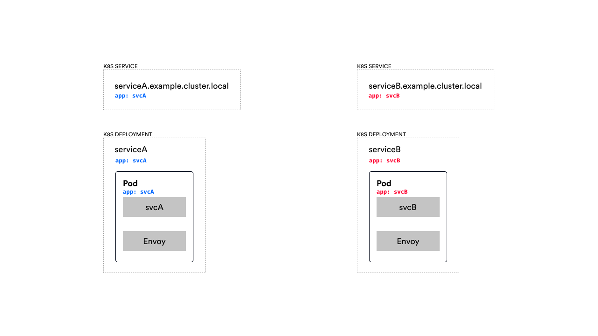
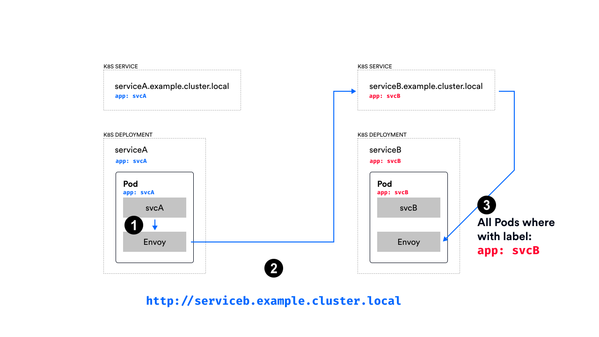
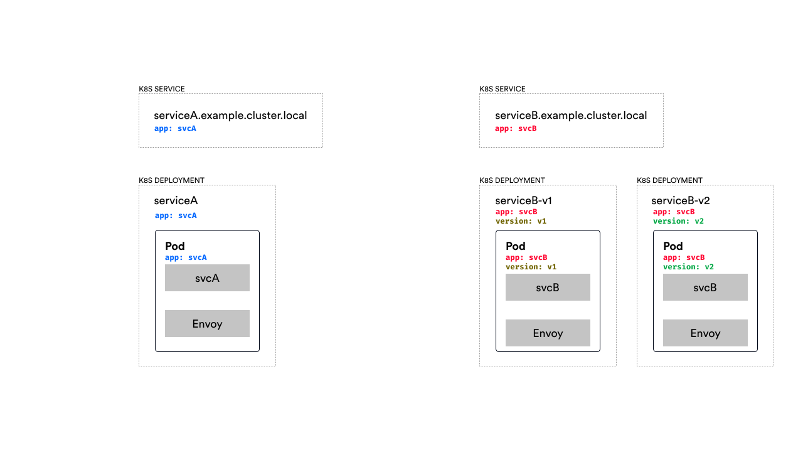
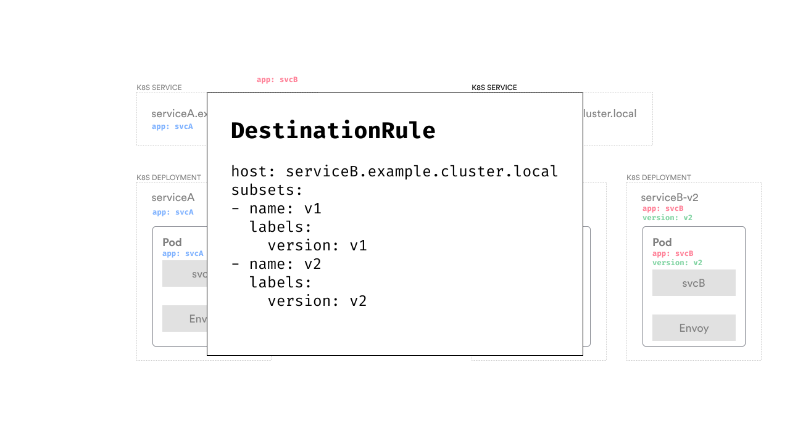
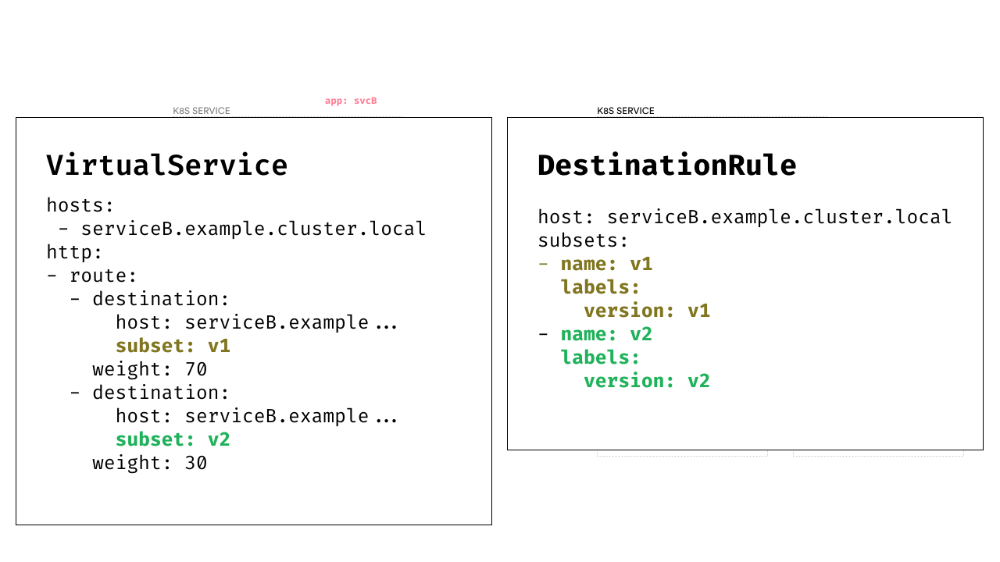
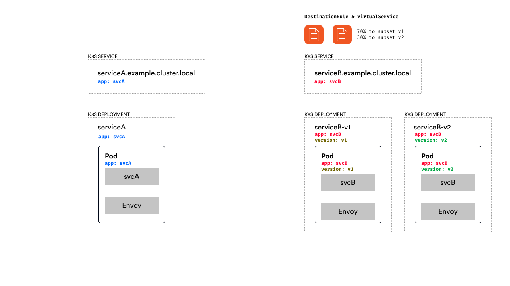
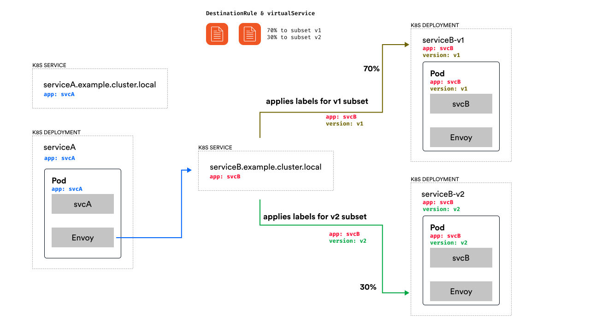
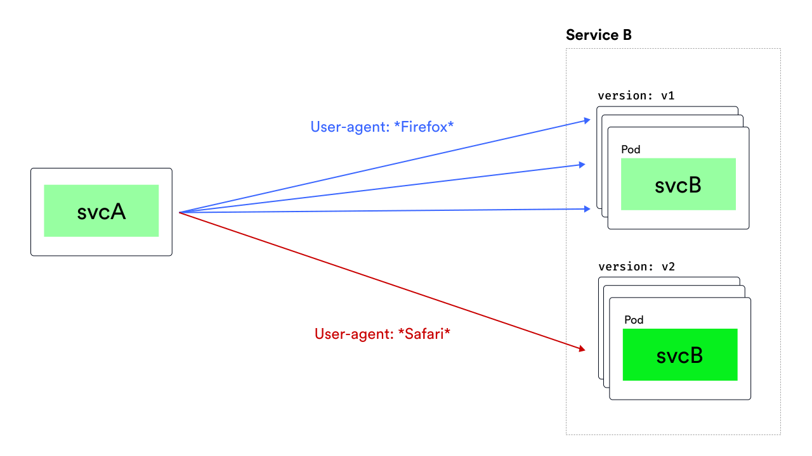

layout: true
class: tetrate-light, regular-slide
.company-logo[ ]

---
class: wordy-slide

# Istio Traffic Management
## Custom resources (1/2)

- **Virtual service**
  - Configure routing rules for each service
- **Destination rule**
  - Configure how to reach the target endpoint, applied after routing decision has been made

???

There a couple of terms and resources we have to talk about in order to describe how traffic management works and how we can route the traffic.

We will talk about multiple resources in Istio - the virtual service we can use to configure routing rules to each service; this is where we can also define how to split the traffic, whether to inject any failures or delays, if we want to mirror the traffic and so on. 

The destination rule resources contain any rules that get applied after routing decisions are made and they configure how to reach the target service. Here's where we could configure the circuit breakers or TLS settings.

We'll also talk about gateways and show how to configure Envoy that’s deployed as a traditional load balancer at the edge of our mesh. The gateway resource controls how Envoy listens on the network interface and certificates it presents. For example, Istio gets deployed with an ingress gateway that can be used to expose Kubernetes services to the outside world. 


---

class: center, middle

# How to route the request?

???

Before Istio and Envoy can make a decision on where to route our request we need a way to describe how our system looks like...


---



???

Let's think about how the call is being made in Kubernetes from one service to another.

So we have a Kubernetes service called service A and a corresponding deployment and the Pods that get created as part of the deployment. We have the same for service b - a Kubernetes service and a deployment.

The thing that's important here are the labels set on the Pods as well as on the Kubernetes service. This is what tells Kubernetes which pods belong to the logical service.

So whenever we make a call to serviceb.example.cluster.local that Kubernetes service maintains a collection of endpoints which equal to the IP addresses of all pods that match the label set on the Kubernetes service.

The Kubernetes service automatically maintains the list of endpoints/the IP addresses. So it watches the if any of the pods with those labels are created or deleted and it updates the list accordingly.

---




???

In step 1 we make the call, call gets intercepted by the proxy and is made to the serviceb.example.cluster.local. From there we eventually end up on one of the Pods that's labeled with the app: svcB label.

This works fine when we have a  version of the service B workload. But how could we describe the system if we have multiple versions of service b for example. The answer is an Istio concept called **subsets** that use Kubernetes labels underneath.

---



???

Practically let's say we have service B version 1 and service B version 2 in the cluster. We'd represent that with two separate deployments. the V1 deployment would have an additional label called version: v1 and then the V2 deployment would have that label set to v2.

However, we'd only have a single Kubernetes service with the same label as before -- app: svcB. If we'd make a request to serviceB now, the call will end up on one of the pods labeled with app:svcB -- this would be a pod from deployment labeled v1 or a pod from deployment labeled v2.

We could create multiple, versions Kubernetes service resources -- so we'd have service-b-v1 and serviceb-v2 -- however that's not practical because from the SvcA we'd have to be explicit about which service we want to call. We want to be always calling the same Kubernetes service, and then decide on the version based on the configuration.

---



???

The subsets can be defined in the DestinationRule resources and they are way to describe the services or subsets of the services. 

In this example we are defining two subsets called v1 and v2 and we specify the corresponding labels for those subsets.

This is the first time we have to do when routing the traffic - we describe our services.

---



???

Then, we can use the VirtualService resource to actually say how we want to split the traffic. For example, we could create two destinations for the service B virtual service - both of them point to the exact same host name - which corresponds to the serviceB kubernetes service, however, they have different subsets defined as well as different weights. 

This configuration is telling Envoy to split the traffic destined to serviceB in such a way that 70% of the traffic goes to the subset called V1 and 30% goes to the subset called V2.


---



???
So assume we created the destination rule and virtual service resources that define the two subsets -v1 and v2 and split the traffic 70/30.

Let's see what happens when the call is made...


---



???

No changes on the service A side -- we still make a call to serviceB.example.cluster.local. 

However, what happens now is we have the destination rule with the subsets and the routing rule with the traffic split defined. So this is telling Envoy to route 70% of all traffic to subset v1 and 30% of all the traffic to subset v2. 

So let's assume the calculation has been made and the call should go to subset v1. The labels that are defined for subset v1 - which is version: v1 are applied to the pod selection -- so in addition to the app: svcB label the version:v1 label is applied as well and that gives us any pods label with those two labels. Then, the normal load balancing happens between the pods with those labels and the call ends up on the Envoy proxy there and then it gets passed through to service B.

Similarly, when the 30% case happens - the v2 labels get applied and the call ends up on one of the pods that run the v2 version of service B.


// Questions??

---

# DestinationRule
## Policies applied to traffic for a specific service 

- Subsets = represent different service versions
- Traffic policies:
  - Load balancer settings (`ROUND_ROBIN`, `LEAST_CONN`, `RANDOM`, `PASSTHROUGH`)
  - Connection pool settings (TCP and HTTP)
  - Outlier detection
  - TLS

???

To recap what we talked about in the previous slides -- one of the resources we introduced was the DestinationRule.

The destination rule is used to defined policies that get applied to the traffic for certain service. In the previous examples we had a destination rule for service B where we declared the two subsets. So subsets are a way to configure different versions of the service and underneath they use labels applied to pods.

The other things we can configure in destination rule are different traffic policies we want to apply to a service are:

- Load balancer settings
- Connection pool settings
- Outlier detection
- and TLS settings

Let's look at these in more details...


---
# Connection pool settings
## Control the volume of connections

- Applied to TCP and/or HTTP connections
- Timeouts
- Max connections/requests
- Max retries


???

With the connection pool settings we can control the volume of connections to the service.

This is where we configure the circuit breaker for either TCP or HTTP connections and configure the  number of connections or request, max number of retries, connection timeouts and so on.

---
class: wordy-slide

# Outlier detection
## How to eject unhealthy hosts

- When to eject unhealthy hosts?
  - e.g. `consecutive5xxErrors`, `consecutiveGatewayErrors`
- How long to eject them for?
  - `baseEjectionTime`
- How many hosts can be ejected? 
  - `maxEjectionPercent`
- When to enable ejection?
  - `minHealthyPercent`


???

With the outlier detection we can control how unhealthy hosts get evicted from the load balancing pool.

Outlier detection is a circuit breaker implementation that tracks the status of each individual host. If the hosts start failing - for example HTTP services returning 500 status codes or TCP services timing out or producing connection errors - these failing hosts can then get ejected for a certain period of time out of the load balancing pool -- this means that none of the request will get routed to those hosts.

The slides shows a couple of settings we need to configure -- for example we need to decide on the threshold for ejecting the unhealthy hosts -- we could say that if there are more than 5 consecutive 500 errors we want to remove that hosts out of the load balancing pool.

Then, we need to decide for how long to eject them -- perhaps the failures were transient and the host will start behaving again later -- we could eject them for 5 minutes or 10 minutes or longer/shorter.

Also, we could configure the maximum number of hosts we want to eject -- for example, we could say that we only want to eject 50% of available unhealthy hosts, and always leave 50% of them running, regardless if they are failing or not. 

Another setting is the minHealthPercent -- using this setting we can say that we only want to enable outlier detection as long as a certain percentage of hosts are in healthy mode. When the percentage of healthy hosts falls under this threshold the outlier detection is disabled and load balancing will happen across all hosts (healthy or unhealthy).


---

# VirtualService

- Routing rules (TCP, HTTP, non-terminated TLS/HTTPS traffic)
  - Match & route
  - Redirect
  - Rewrite
  - Mirroring
  - Cors, Timeouts, retries, and fault injection
- Header manipulation

???

The second resource we mentioned was the VirtualService -- using this resource we can configure how to route traffic -- we've already seen how to split traffic based on the percentage, but inside this resource we can also define routing rules and matching criteria for traffic. The way it works is that we specify how to match specific traffic -- by some request properties and then specify where we want the traffic to be routed to.

We can also redirect the traffic directly to another service, we can rewrite the URIs and authority headers, we can mirror percentage of the traffic to a different service and so on.

We can also control things such as timeouts, retries and fault injection. We can specify timeouts for all calls made to a services, or we can configure retries as well as fault injection where we can inject either delays or errors for percentage of the traffic. For example, we could inject 5 second delays for 40% of the traffic going to service B. Or we could say service B will return an HTTP 404 in 20% of the time. These feature are useful for testing service resiliency.

Other features are ability to configure CORS policy for a given service -- we could set the origins, methods and other CORS settings for services. 

Finally, we can also manipulate headers -- both request and response -- we could add or remove specific headers from the requests.

---



???

Here's an example of how we could split traffic based on the user agent -- so if the user-agent header contains the word "Firefox" the traffic goes to version 1 subset of service B, otherwise if it's any other user agent, it will go to v2.

---

# Match on headers

```yaml
hosts:
  - svcB.example.cluster.local
http:
- match:
  - headers:
      user-agent:
        regex: ".*Firefox.*"
  route:
  - destination:
      host: svcB.example.cluster.local
      subset: v1
- route:
  - destination:
      host: svcB.example.cluster.local
      subset: v2
```

???

And here's how we could write that configuration... We'd do a match first for the user agent header -- to match the value we could either use a regular expression or we could check for an exact string and then, for that match we define the destination and the subset -- in our case the v1 subset of service B.

If the user-agent header doesn't match, we route to the subset v2. Note that we could define multiple match conditions and we can use either the AND semantics or OR semantics. 

---

# AND semantics

```yaml
hosts:
  - svcB.example.cluster.local
http:
- match:
  - headers:
      x-debug:
        exact: dev
    uri:
      prefix: /api/debug
  route:
  - destination:
      host: svcB.example.cluster.local
      subset: v1
- route:
  - destination:
      host: svcB.example.cluster.local
      subset: v2
```

???
For example -- this virtual service will check the value of the x-debug header and if the value exactly matches the string "dev" AND if the request URI starts with /api/debug, then we'll route to the v1 subset.

---

# OR semantics

```yaml
hosts:
  - svcB.example.cluster.local
http:
- match:
  - headers:
      x-debug:
        exact: dev
  - uri:
      prefix: /api/debug
  route:
  - destination:
      host: svcB.example.cluster.local
      subset: v1
- route:
  - destination:
      host: svcB.example.cluster.local
      subset: v2
```

???

If we wanted to do the OR semantic and say either header matches that value OR the uri prefix is /api/debug we'd just add another match block -- previously we had a single match blog, now we have two of them -- one for headers, another one for URI.

---

# Timeout, retries

```yaml
hosts:
  - svcB.example.cluster.local
http:
- route:
  - destination:
      host: svcB.example.cluster.local
      subset: v1
    weight: 30
    timeout: 5s
  - destination:
      host: svcB.example.cluster.local
      subset: v2
    weight: 70
    timeout: 0.5s
  retries:
    attempts: 3
    perTryTimeout: 2s
    retryOn: connect-failure
```

???

Here's another example of how we could configure retries and timeouts --

We have the percentage based traffic split and we're setting the timeout for subset v1 to 5 seconds and for subset v2 to 0.5s. 

Additionally, we're defining the retry policy for all hosts part of the service B Kubernetes service. We're specifying 3 retries and a per try timeout as well as the status codes we want to retry on. 
If we wanted to do the OR semantic and say either header matches that value OR the uri prefix is /api/debug we'd just add another match block -- previously we had a single match blog, now we have two of them -- one for headers, another one for URI.
